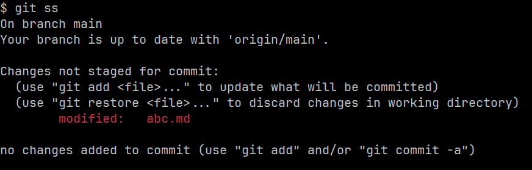
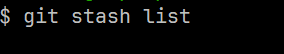
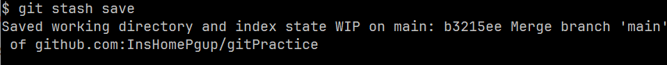

### stash的场景
正在feat/newComponent干活的时候，写了四五个文件但是没写完。
需要临时切换到hotfix/issue#1 去修复线上的紧急维护内容。
commit的话，这个内容没结束不好提交。
可以先使用stash暂存当前的代码，等hotfix完成以后再切换到feat pop stash。

这个场景就是A分支还没完成但是需要到B分支去做一点事情，可以使用stash。
stash也可以像是临时的可随时恢复的commit。

### 常用命令

#### 查看工作区状态

```bash
git status
```



#### 查看当前的stash的内容

``` bash
git stash list

```

当前还没有stash的内容所以是空的，看不到东西



#### 创建一个stash

```bash
git stash save
```




#### 再次查看stash list

```

git stash list

```

```text
$ git stash list
stash@{0}: WIP on main: b3215ee Merge branch 'main' of github.com:InsHomePgup/gitPractice
```
#### 查看stash和当前最新commit之间的差异

文件变化查看
```
$ git stash show
 abc.md | 1 +
 1 file changed, 1 insertion(+)
```
详细内容查看

```
git stash show -p
```


根据stash的名称去查看

```
$ git stash show stash@{0}
 abc.md | 1 +
 1 file changed, 1 insertion(+)
```

#### 将stash的内容pop到工作区

也就是将刚刚stash 暂存起来的修改内容回归到工作区

pop 其实是两个stash命令的结合，apply & drop。
也就是将代码应用到工作区以后删除这个stash，也可以只进行apply，再drop，可以根据实际工作场景切换。

```
$ git stash pop stash@{0}
On branch main
Your branch is up to date with 'origin/main'.

Changes not staged for commit:
  (use "git add <file>..." to update what will be committed)
  (use "git restore <file>..." to discard changes in working directory)
        modified:   abc.md

no changes added to commit (use "git add" and/or "git commit -a")
Dropped stash@{0} (75db754150747fca40de7c52ba7815170db4dd76)

```


